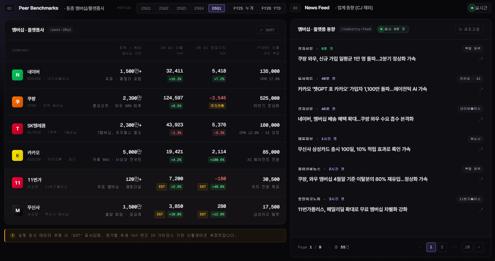

# 실적 분석 및 실시간 뉴스 대시보드 구축

### 🤷‍♀️활용 기능

| 기능     | 기능명                     |
| ------ | ----------------------- |
| Plugin | Superpowers             |
| MCP    | PlayMCP summarize\_news |

### 📝요구 사항

아래 요건에 맞게실적 및 실시간 뉴스 대시보드 구축해줘\
\
분석 대상 : CJ그룹사 및 플랫폼/멤버십사\
실적 분석 : 전자 공시(Dart) 데이터 기반25년 연간/ 26년 1분기 손익을 확인 (Dart API Key 제공)\
실시간 뉴스 : PlayMCP의 summarize\_news 기능 활용하여 실시간 뉴스 업데이트\
뉴스 검색 기간 : 최근 한 달 내 대상 기업의 내용이 들어가 있는 기사 서치\
※ 뉴스 클릭 시 기사 페이지로 랜딩

### 🤖결과물

<figure><figcaption></figcaption></figure>

<figure><figcaption></figcaption></figure>
